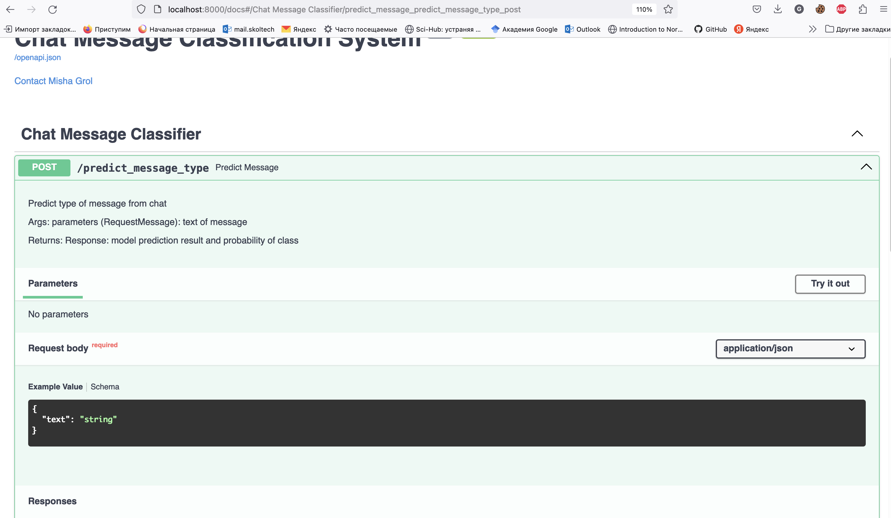

# ChatClassificationTask
Test task for chat text classification problem

------

Обучение моделей и эксперименты производятся в Google Colab 

## Google Colab 

Open `TextClassification.ipynb` in Google Colab!

## API

Интерфейс модели реализован через FastAPI. Для запуска микросервиса требуется docker и docker-compose.

1. Чтобы развернуть API локально на компьютере клонируйте код локально на компьютер

`git clone https://github.com/mishagrol/ChatClassificationTask.git`

2. Перейди в директорию с кодом

`cd ChatClassificationTask`

3. Запустите docker-compose, который соберет image и запустит сервис на `uvicorn`

`docker-compose up`

4. В случае удачного запуска вы увидете локальный адресс на котором работает код

`~> Uvicorn running on http://0.0.0.0:8000`

5. Чтобы протестировать работу API перейдите по ссылке [Docs](http://localhost:8000/docs)

6. Вам станет доступна панель Swagger в котором вы можете передать сообщение из чата в метод POST - `/predict_message_type`

__Пример документации__

	
	 

